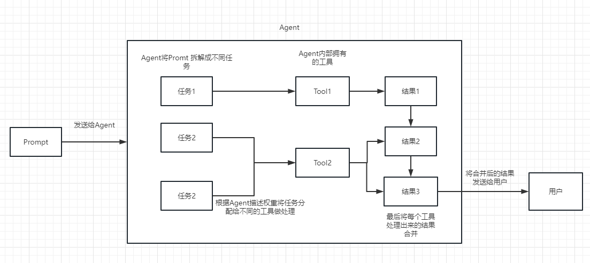

# 框架

| 框架        | 类型  | 语言    | 应用场景      |
|-----------|-----|-------|-----------|
| LangChain | LLM | Py/JS | 航班助手、数据分析 |

## LangChain
LangChain 是基于提示词工程(Prompt Engineering)，提供一个桥接大型语言模型(LLMs)以及实际应用App的胶水层框架。

* Loader 加载器：如 DirectoryLoader, CSVLoader, PyPDFLoader, YoutubeLoader....
* LLM Wrapper：连接大模型的包装器
* Component 组件：为LLMs提供接口封装、模板提示和信息检索索引
* Chain：组装component以完成特定任务
* Agent 代理：使用大模型API完成特定功能
* Model 模型：负责理解和生成语言，提示用于引导模型输出
* Embedding 向量化
* VectorStore 向量存储：使用Chroma

