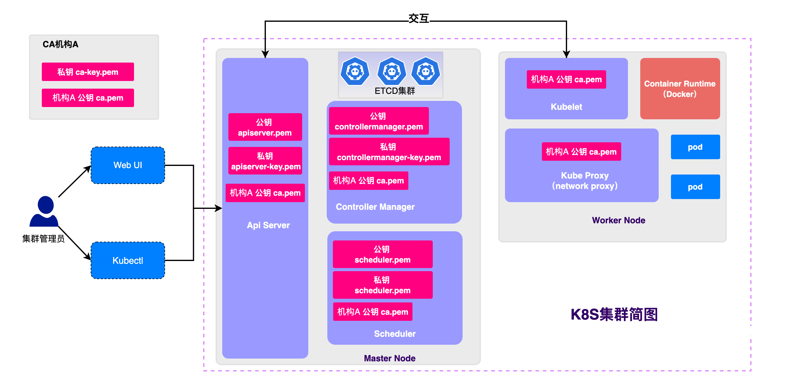
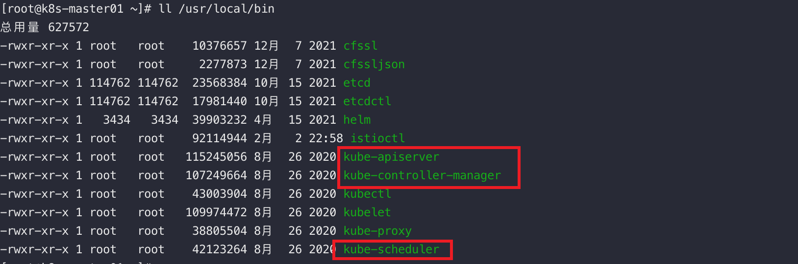
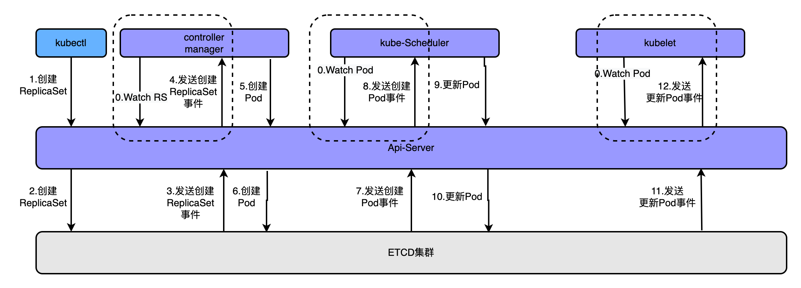

# Kubernetes



一个有效的K8S部署称为集群，K8S集群分为：控制平面（Master Node）和计算设备（又称节点 Worker Node)，两大部分和五大组件。

Master Node 并不是一个进程，而是一个包含3个进程（进程名为：kube-apiserver、kube-controller-manager、kube-scheduler）和1个ETCD集群的抽象概念。




**控制平面（Master Node）核心组件：**
* ETCD 集群：存储配置和集群状态
* Kube API Server：网关。WebUI 和 Kubectl 都需要经过网关API，具有安全验证机制。
* Kube Scheduler：调度Pod到合适节点，调度器会考虑容器集的资源需求以及集群运行状况。
* Kube Controller Manager：控制器上运行集群，控制器管理器将多个控制器合而为一。

计算设备（Worker Node）包含2个进程： Kubelet 和 Kube-Proxy。如果在Master Node启动 kubelet 和 kube-proxy 进程，那么Master Node也会拥有Worker Node能力，即单机部署。

**K8S集群至少需要1个计算节点，每个计算节点都有：**

* 1个容器运行时引擎：Docker
* 1个Kubelet：与控制平面通信，执行控制平面具体操作，如Node节点管理、Pod管理（交互下发容器创建/关闭命令）、健康检查
* 1个Kube-Proxy：处理集群内外通信或转发流量的网络代理

**K8S 为什么建议最少2个CPU核心？**

答：ETCD、kubectl执行API，以及调度都存在IO瓶颈，当单核CPU出现阻塞时，集群心跳和状态可能因延迟而被错误标记不可用，引发Pod误杀和重新调度，形成雪崩效应。

**Kubectl 创建容器组（Pod）流程**



容器组（Pod）是创建和管理的最小可部署的计算单元，即一组（或一个）容器，这些容器共享存储、网络等。最常用的是一个Pod里面一个容器，少数情况下才需要将共享资源的多个容器放到同一个Pod下。

```yaml
# pods/simple-pod.yaml
apiVersion: v1
kind: Pod
metadata:
  name: nginx
spec:
  containers:
    - name: nginx
      image: nginx:1.14.2
      ports:
        - containerPort: 80
```

```shell
# 创建上面的Pod
kubectl apply -f https://k8s.io/examples/pods/simple-pod.yaml
```

**Pod phrase：**

| phrase         | status        | 说明                                                                        |
|----------------|---------------|---------------------------------------------------------------------------|
| Pending 	      | waiting 或 N/A | Pod 已被 Kubernetes 系统接受，但有一个或者多个容器尚未创建亦未运行。此阶段包括等待 Pod 被调度的时间和通过网络下载镜像的时间。 |
| Running 	      | running       | Pod 已经绑定到了某个节点，Pod 中所有的容器都已被创建。至少有一个容器仍在运行，**或者正处于启动或重启状态**。              |
| **Succeeded**	 | terminated    | Pod 中的所有容器都已成功结束，并且不会再重启。                                                 |
| Failed 	       |               | Pod 中的所有容器都已终止，并且至少有一个容器是因为失败终止。也就是说，容器以非 0 状态退出或者被系统终止，且未被设置为自动重启。       |
| Unknown        |               | 	因为某些原因无法取得 Pod 的状态。这种情况通常是因为与 Pod 所在主机通信失败。                              |

当Pod反复启动失败，status 可能出现 CrashLoopBackOff。若Pod被删除，status 可能出现 Terminating。